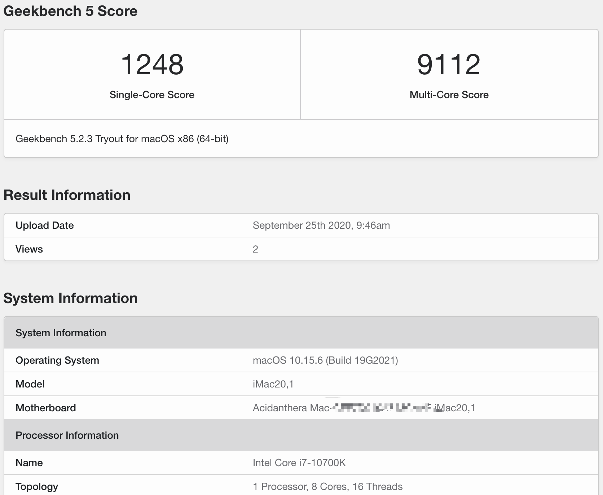
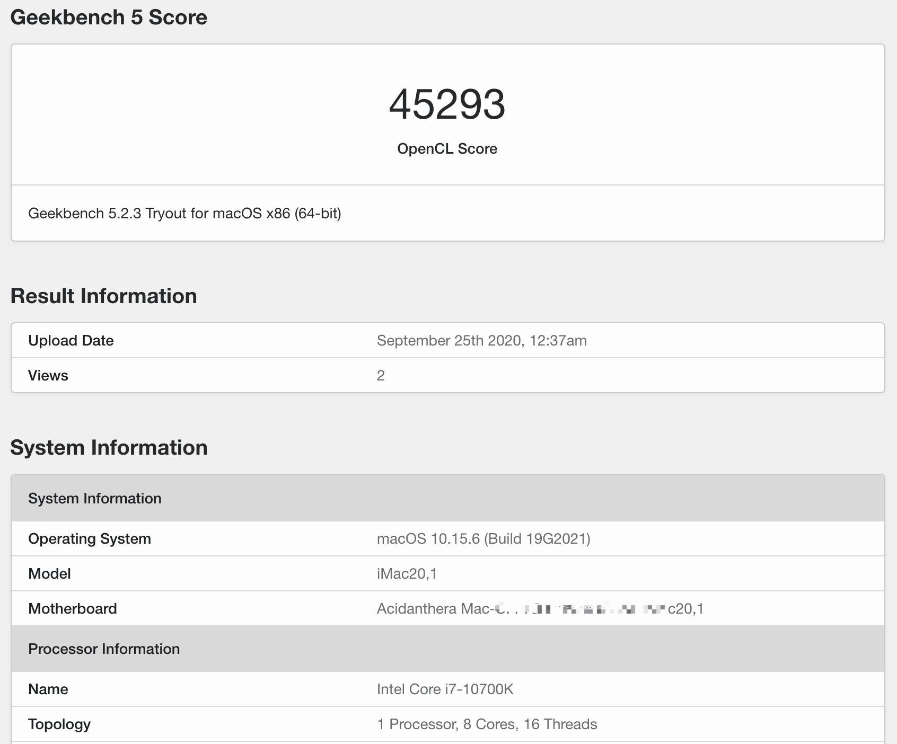
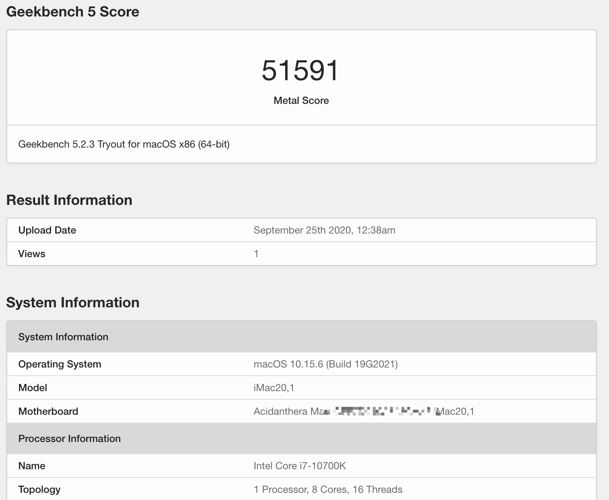
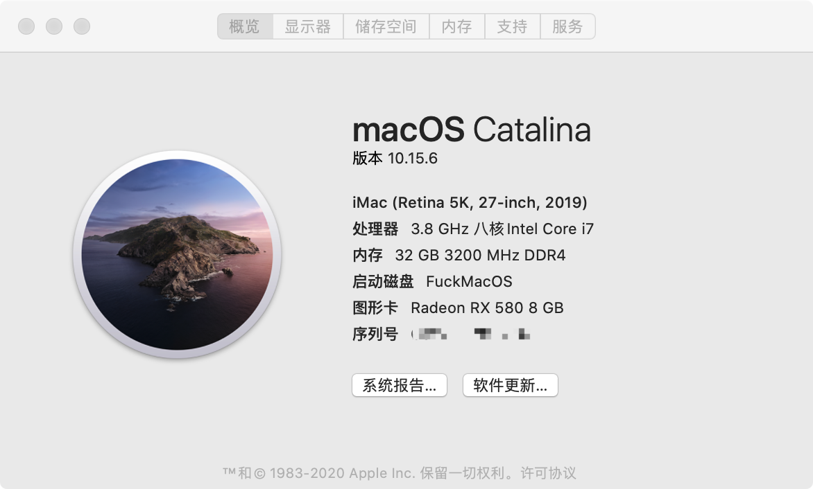
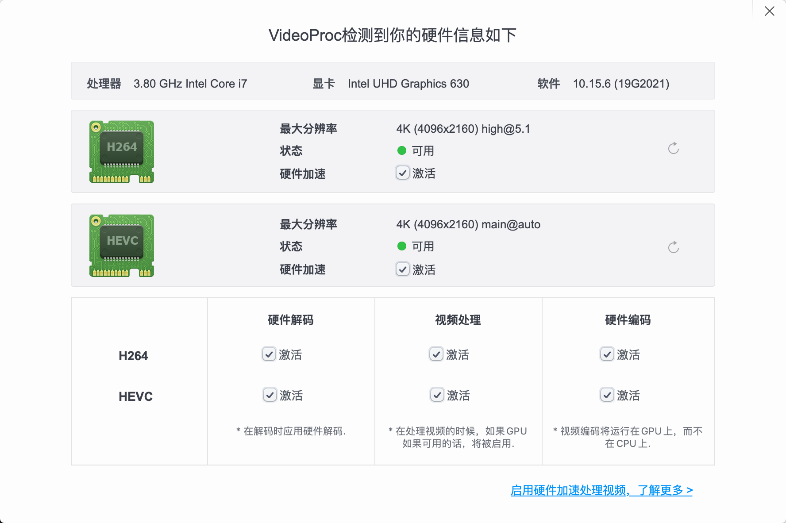
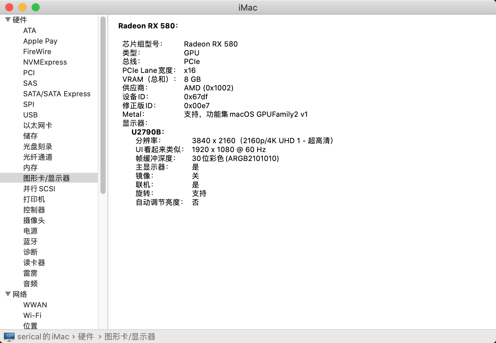
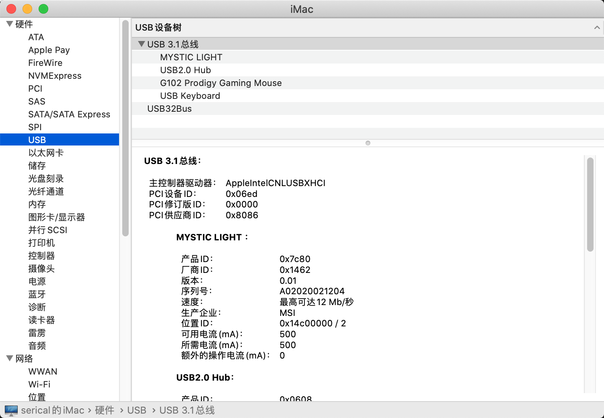
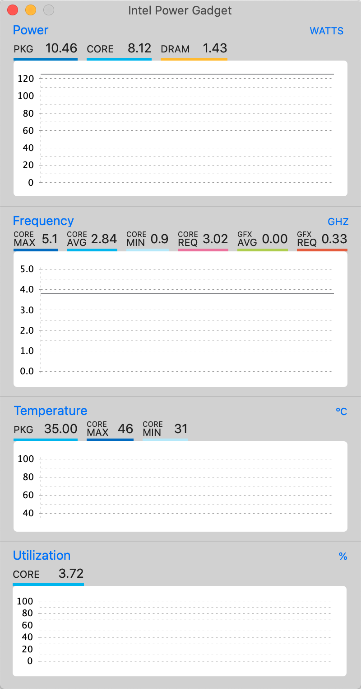

# 微星Z490+10700K+RX580
> 参考资料
>
> [ Creating the USB](https://dortania.github.io/OpenCore-Install-Guide/installer-guide/)
>
> [CometLake十代Intel平台台式机Opencore黑苹果通用配置教程](https://www.bilibili.com/video/BV1uf4y1X7MT?p=1)
>
> [Intel Coffee Lake平台完美黑苹果系统安装教程](https://www.bilibili.com/video/BV1hA411t7dr)


## 硬件配置
| 配置  | 型号                           |
| ----- | ------------------------------ |
| CPU   | 英特尔（Intel）i7-10700K       |
| 主板  | MSI MAG Z490 TOMAHAWK 战斧导弹 |
| 内存  | 科赋KLEVV DDR4 16G 3200*2      |
| 固态1 | Samsung/三星970PRO 1T(macOS)   |
| 固态2 | 西部数据SN750 1TB SSD(Windows) |
| 显卡  | 华硕（ASUS）DUAL-RX580-O8G   |


# BIOS Settings
- Above 4GB MMIO BIOS Assignment: Enabled
- Internal Graphics: Enabled
- Fast Boot: Disabled
- Secure Boot Mode: Standard
- Wake Up Event By: OS
- Above 4G memory/Crypto Currency mining: Enabled
- IGD Multi-Monitor: Enabled
- Extreme Memory Profile(XMP): Enabled
- Intel Virtualization Tech: Disabled
- CFG Lock: Disabled


# Windows和macOS双系统时间不一致问题
win修改注册表
```shell
Reg add HKLM\SYSTEM\CurrentControlSet\Control\TimeZoneInformation /v RealTimeIsUniversal /t REG_DWORD /d 1
```


## GeekBench 跑分
### CPU跑分

### 显卡OpenCL跑分

### 显卡Metal跑分



## 系统预览
### 概览

### 核显加速

### 显卡

### USB

### CPU频率

